# GeekMagic Display for Home Assistant

[](https://github.com/hacs/integration)

<p align="center">
  
</p>

A Home Assistant custom integration for GeekMagic displays (SmallTV Pro, Ultra, and similar ESP8266/ESP32-based devices).

> **How it works:** This integration renders dashboard images directly in Home Assistant using Python/Pillow and pushes them to your GeekMagic device over HTTP. No flashing required - works with stock firmware.

---

### Disclaimers

> **Early Software:** This project is in active development. Expect bugs, breaking changes, and incomplete features. The API and configuration format may change between versions.

> **Vibe Coded:** This integration was largely vibe-coded with AI assistance. While functional, it may contain unconventional patterns or rough edges. Contributions and feedback welcome!

---

### Background & Credits

I have a **GeekMagic Ultra** with ESP8266, which has [limited possibilities for flashing with ESPHome](https://community.home-assistant.io/t/installing-esphome-on-geekmagic-smart-weather-clock-smalltv-pro/618029). Instead of fighting the hardware, this integration takes a different approach: render everything server-side and push images to the device.

Special thanks to:
- The [Home Assistant Community thread](https://community.home-assistant.io/t/installing-esphome-on-geekmagic-smart-weather-clock-smalltv-pro/618029) for documenting GeekMagic device capabilities
- **[Aydar (@aydarik)](https://community.home-assistant.io/t/installing-esphome-on-geekmagic-smart-weather-clock-smalltv-pro/618029/214)** for sharing the [bash script](https://gist.github.com/aydarik/e81edaf63041a85fb0325a1c8c2e4bac) that demonstrated how to push images to these devices - the core inspiration for this integration

---

## Dashboard Samples

<p align="center">
  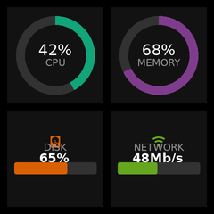
  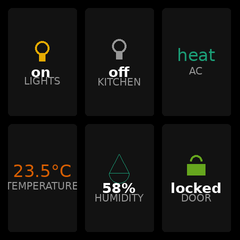
  
  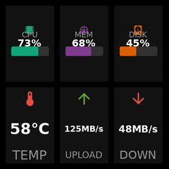
</p>

<p align="center">
  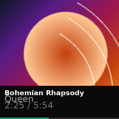
  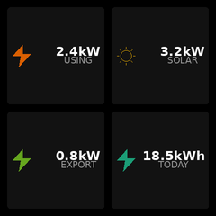
  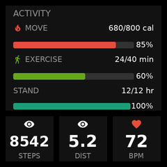
  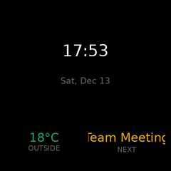
</p>

<p align="center">
  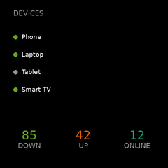
  
  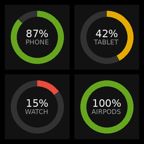
  
</p>

## Widget Gallery

| Widget | 1x1 | 1x2 | 2x1 | 2x2 | 2x3 | 3x3 |
|--------|-----|-----|-----|-----|-----|-----|
| **Gauge (Bar)** | 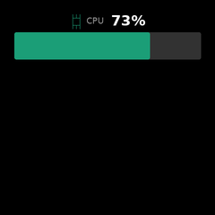 | 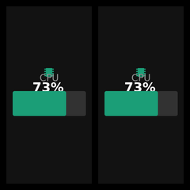 | 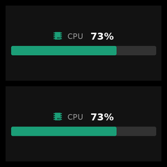 | 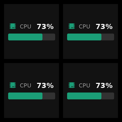 | 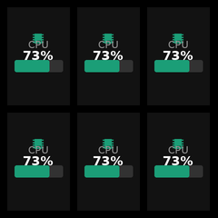 | 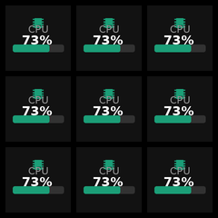 |
| **Gauge (Ring)** | 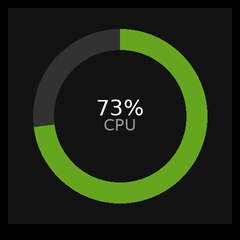 | 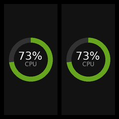 | 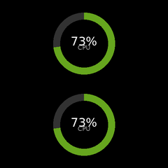 | 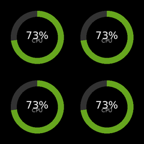 |  | 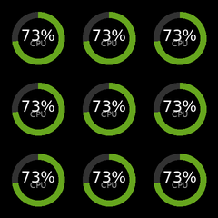 |
| **Gauge (Arc)** | 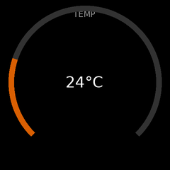 | 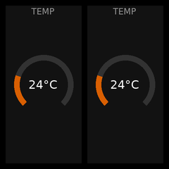 | 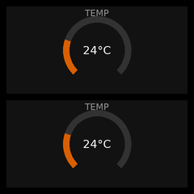 | 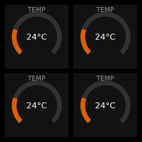 | 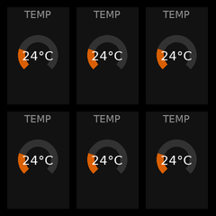 | 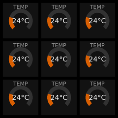 |
| **Entity (Icon)** | 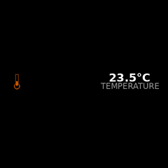 | 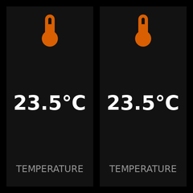 | 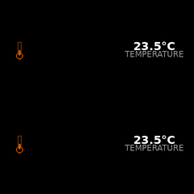 | 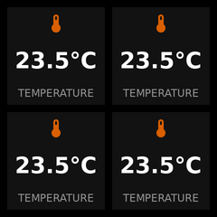 | 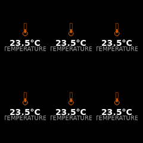 | 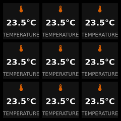 |
| **Entity (Plain)** | 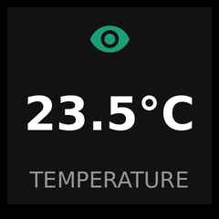 | 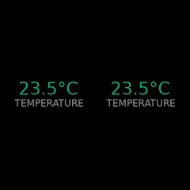 | 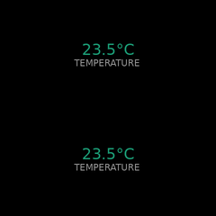 | 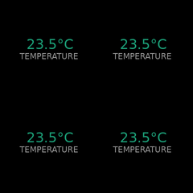 | 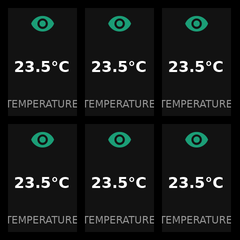 | 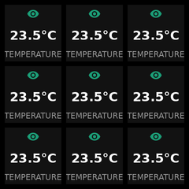 |
| **Clock** | 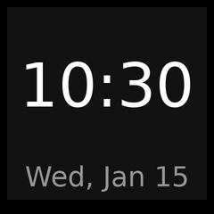 | 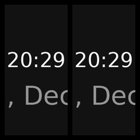 | 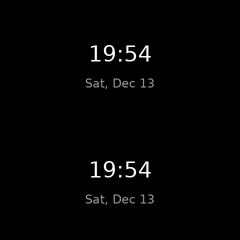 | 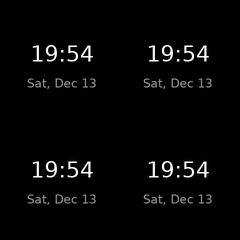 | 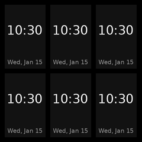 | 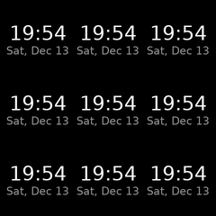 |
| **Text** |  | 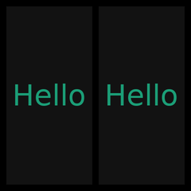 | 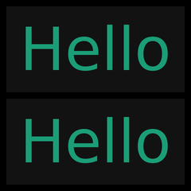 | 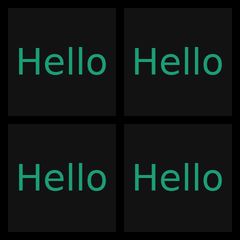 | 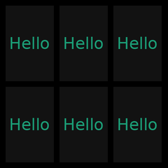 | 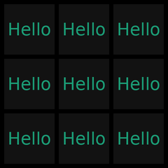 |
| **Progress** | 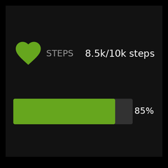 |  |  |  |  |  |
| **Weather** |  |  |  |  |  |  |
| **Status** |  |  |  |  |  |  |
| **Chart** |  |  |  |  |  |  |

## Layout Examples

### Fullscreen & Grid Layouts

<p align="center">
  
  
  
  
  
</p>

### Split Layouts

<p align="center">
  
  
  
  
</p>

### Column & Row Layouts

<p align="center">
  
  
</p>

### Hero Layouts

<p align="center">
  
  
  
  
  
  
</p>

### Sidebar Layouts

<p align="center">
  
  
</p>

## Themes

Choose from **10 built-in themes** that go beyond just colors - affecting typography, spacing, shapes, and visual effects.

### Dark Themes

| Classic | Minimal | Neon | Retro | Soft |
|:-------:|:-------:|:----:|:-----:|:----:|
|  |  |  |  |  |
| Balanced with rounded corners | Sharp, monochrome | Cyberpunk with glow | Terminal scanlines | Cozy, very rounded |

### Colored & Light Themes

| Ocean | Sunset | Forest | Light | Candy |
|:-----:|:------:|:------:|:-----:|:-----:|
|  |  |  |  |  |
| Deep blue, nautical | Warm coral/orange | Natural earth tones | Clean white background | Playful pastels |

---

## Features

- **12 widget types**: Clock, entity, media, chart, text, gauge, progress, weather, status, camera, and more
- **19 layout options**: Fullscreen, grids, splits, hero variants, sidebars, and more
- **10 visual themes**: Classic, Minimal, Neon, Retro, Soft, Light, Ocean, Sunset, Forest, Candy
- **Visual configuration**: Custom sidebar panel with live preview
- **Global views**: Create views once, assign to multiple devices
- **Multi-screen support**: Assign multiple views per device with auto-cycling
- **Pure Python rendering**: Uses Pillow for image generation (no browser required)
- **Configurable refresh**: Updates every 5-300 seconds

## Installation

### HACS (Recommended)

1. Open HACS in Home Assistant
2. Click "Custom repositories"
3. Add this repository URL
4. Install "GeekMagic Display"
5. Restart Home Assistant

### Manual

1. Copy `custom_components/geekmagic` to your Home Assistant's `custom_components` folder
2. Restart Home Assistant

## Configuration

### Adding a Device

1. Go to **Settings** → **Devices & Services**
2. Click **Add Integration**
3. Search for "GeekMagic"
4. Enter your device's IP address

### Using the GeekMagic Panel

After installation, a **GeekMagic** item appears in your sidebar.

#### Views Tab

Create and manage display views:

- **Create views** with the "+ Add View" button
- **Edit views** by clicking on them
- **Delete views** via the menu on each card

#### View Editor

The editor provides a live preview and widget configuration:

<p align="center">
  
</p>

- **Preview**: See real-time rendering as you configure
- **Layout**: Choose grid size (2x2, 2x3, 3x2, hero, split, etc.)
- **Theme**: Select from 10 visual themes
- **Widgets**: Each slot shows a position grid - click cells to swap widget positions
- **Entity picker**: Native Home Assistant entity selector with filtering

#### Devices Tab

Assign views to your GeekMagic devices:

- Check which views each device should display
- Devices automatically cycle through assigned views
- Drag to reorder the rotation sequence

#### Device Info Page

Each device exposes entities for brightness, refresh interval, mode selection, and status:

<p align="center">
  
</p>

---

## Entities

Each GeekMagic device creates the following entities for control and monitoring:

### Controls

| Entity | Type | Description |
|--------|------|-------------|
| `number.geekmagic_brightness` | Number | Display brightness (0-100%) |
| `number.geekmagic_refresh_interval` | Number | Update interval (5-300 seconds) |
| `select.geekmagic_mode` | Select | Device mode (Custom Views, Clock, Weather, System Info) |
| `select.geekmagic_current_view` | Select | Currently displayed view (when in Custom mode) |

### Sensors

| Entity | Type | Description |
|--------|------|-------------|
| `sensor.geekmagic_status` | Sensor | Connection status with device attributes |
| `sensor.geekmagic_storage_used` | Sensor | Device storage usage percentage |
| `sensor.geekmagic_storage_free` | Sensor | Free storage in KB |

### Buttons

| Entity | Type | Description |
|--------|------|-------------|
| `button.geekmagic_refresh` | Button | Force immediate display refresh |
| `button.geekmagic_next_screen` | Button | Switch to next view in rotation |
| `button.geekmagic_previous_screen` | Button | Switch to previous view in rotation |

---

## Widget Types

| Type | Description |
|------|-------------|
| `gauge` | Bar, ring, or arc gauge (`style: bar/ring/arc`) |
| `entity` | Any HA entity value (with optional `icon`) |
| `clock` | Time and date |
| `text` | Static or dynamic text |
| `progress` | Goal tracking with progress bar |
| `weather` | Weather with forecast |
| `status` | Binary sensor indicator |
| `chart` | Sparkline from entity history |
| `camera` | Camera snapshot display |
| `media` | Now playing from media player |
| `multi_progress` | Multiple progress items |
| `status_list` | Multiple status indicators |

## Layout Types

| Layout | Slots | Description |
|--------|-------|-------------|
| `fullscreen` | 1 | Single widget fills entire display (no padding) |
| `grid_2x2` | 4 | 2x2 grid of equal widgets |
| `grid_2x3` | 6 | 2 rows, 3 columns |
| `grid_3x2` | 6 | 3 rows, 2 columns |
| `grid_3x3` | 9 | 3x3 grid of equal widgets |
| `split_horizontal` | 2 | Left/right side by side |
| `split_vertical` | 2 | Top/bottom stacked |
| `split_h_1_2` | 2 | Narrow left (1/3), wide right (2/3) |
| `split_h_2_1` | 2 | Wide left (2/3), narrow right (1/3) |
| `three_column` | 3 | 3 vertical columns |
| `three_row` | 3 | 3 horizontal rows |
| `hero` | 4 | Large hero + 3 footer widgets |
| `hero_simple` | 2 | Large hero + 1 footer widget |
| `hero_corner_tl` | 6 | 2x2 hero top-left + 4 small widgets |
| `hero_corner_tr` | 6 | 2x2 hero top-right + 4 small widgets |
| `hero_corner_bl` | 6 | 2x2 hero bottom-left + 4 small widgets |
| `hero_corner_br` | 6 | 2x2 hero bottom-right + 4 small widgets |
| `sidebar_left` | 4 | Wide left panel + 3 right rows |
| `sidebar_right` | 4 | 3 left rows + wide right panel |

---

## Device Compatibility

Tested with:
- GeekMagic SmallTV Ultra (240x240, ESP8266)

Should work with any GeekMagic device that supports the `/doUpload` HTTP API.

**Important:** This integration works with the **stock firmware** that ships with GeekMagic devices. No custom firmware or flashing required - just connect your device to your network and add the integration.

## Development

```bash
uv sync                              # Install dependencies
uv run pytest                        # Run tests
uv run ruff check .                  # Lint
uv run pre-commit run --all-files    # Run all checks
uv run python scripts/generate_samples.py  # Generate samples
```

## License

MIT
